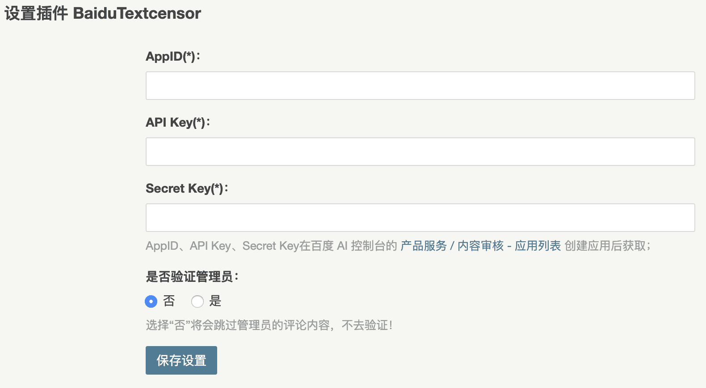

<h2 align="center">Baidu TextCensor</h2>

<p align="center">
🗑 在 Typecho 中加入百度文本内容审核，过滤评论中的敏感内容
</p>

## 百度文本内容审核

[百度文本内容审核](https://ai.baidu.com/tech/textcensoring)能一站式检测文本中夹杂的色情、推广、辱骂、违禁、涉政、灌水等垃圾内容，净化网络环境，为您的应用提供更可靠的内容安全保障，运用业界领先的深度学习技术，判断一段文本内容是否符合网络发文规范，实现自动化、智能化的文本审核，大幅节省内容审核的人力成本，为您的产品体验保驾护航

### 能力介绍

* 文本色情：对文本中的色情行为描述、色情资源链接、低俗交友、污秽文爱等内容进行识别
* 暴恐违禁：对暴力行为、恐怖描述、赌博、毒品、枪支弹药等违禁内容进行识别
* 政治敏感：对文本中的敏感事件、涉政人物、散布谣言、反动宣传等内容进行识别
* 恶意推广：对文本中带有售卖意向的软文广告，微信、QQ等个人联系方式等违规内容及变体进行识别
* 低俗辱骂：对文本中的侮辱谩骂、人身攻击、消极宣泄等内容进行识别
* 低质灌水：对网络社区常见的乱码、水帖、刷屏等无意义的灌水信息进行识别

## Typecho

### 安装

1. 从 [Github](https://github.com/sy-records/ty-baidu-textcensor/releases) 下载源码，将源码上传到 Typecho 插件目录 `usr/plugins`

2. 修改插件文件名为`BaiduTextCensor`

3. 修改目录权限和用户组

```bash
chown -R www:www BaiduTextCensor/
chmod 755 BaiduTextCensor/runtime
```

4. 启用~

### 设置



在百度Ai控制台的 [产品服务 / 内容审核 - 应用列表 创建应用](https://console.bce.baidu.com/ai/?fromai=1#/ai/antiporn/app/list) 后获取 AppID、API Key、Secret Key

## 其他

### WordPress

在 WordPress 后台安装插件页面搜索 `Baidu TextCensor`

项目地址：[https://github.com/sy-records/wp-baidu-textcensor](https://github.com/sy-records/wp-baidu-textcensor)

### 其他博客系统

在其他博客系统中，如 ThinkPHP、Laravel 等，可以直接使用 composer 包，自行调用处理

项目地址：[https://github.com/sy-records/baidu-textcensor](https://github.com/sy-records/baidu-textcensor)

## License

Apache-2.0
